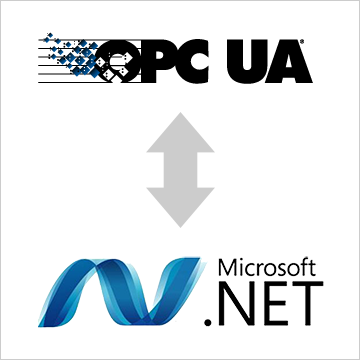

# ioBroker.my-opcua

**Tests:** 

## my-opcua adapter for ioBroker

OPCUA Client

## Following data types are supported:

number
string
boolean

## Usage
* install .net framework 4.6 , Node.js v18.14.0
## Changelog
### 0.0.1 (2023-09-26)
<!--
    Placeholder for the next version (at the beginning of the line):
    ### **WORK IN PROGRESS**
-->
### **WORK IN PROGRESS**
* (Kamran Mustafayev) initial release

-->

## License
MIT License

## License
MIT License

Copyright (c) 2023 Kamran Mustafayev <gokturk413@gmail.com>

Permission is hereby granted, free of charge, to any person obtaining a copy
of this software and associated documentation files (the "Software"), to deal
in the Software without restriction, including without limitation the rights